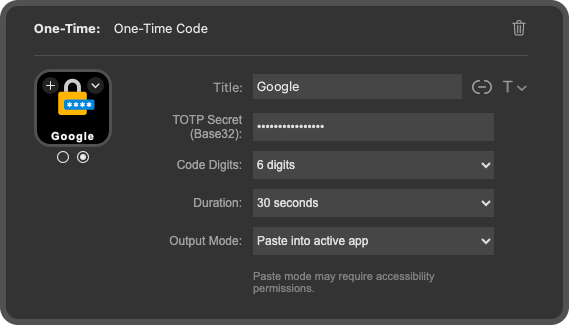

# One-Time

Turn your Elgato Stream Deck into a simple, reliable one-time code button. Generate a time-based one-time password on demand, paste it where you need it, and move on without breaking your flow.

## What It Does

One-Time adds a single action to Stream Deck that generates time-based one-time passwords (TOTP) from a shared secret.

Assign the **One-Time Code** action to a key, enter a Base32 secret in the Property Inspector, and press the key whenever you need a code. The plugin generates the current TOTP and outputs it using your chosen mode.

Pressing the key again during the same time window reuses the same code. Once the window expires, the next press generates a fresh one.

There is no need to open an authenticator app or switch contexts. One-Time is designed to be fast, predictable, and easy to glance at while you work.

This is especially useful for development, demos, and internal tools where TOTP codes are still required frequently and you want to keep your hands on the keyboard.

## Features

- **One-press code generation**  
  Press the button to generate the current one-time code

- **Copy or paste output**  
  Copy the code to the clipboard or paste it directly into the active app

- **Smart reuse**  
  Repeated presses during the same TOTP window reuse the same code

- **Per-key configuration**  
  Each key stores its own secret, digit length (6 or 8), time period (15 / 30 / 60), and output mode

- **Visual state feedback**  
  Icons clearly indicate configured, unconfigured, and invalid states

## Gallery

### Button States

| Configured | Unconfigured | Invalid |
|:-------------:|:-----------:|:--------:|
|  |  |  |
| Ready to generate codes | Requires setup | Secret is not valid Base32 |

### Settings Panel



*Property Inspector showing secret, digit length, time period, and output mode*

## Installation

### From the Stream Deck Marketplace (Pending Publication)

1. Open the Stream Deck application
2. Go to the Marketplace
3. Search for "One-Time"
4. Click Install

### Manual Installation (Development)

1. Clone this repository:
   ```bash
   git clone https://github.com/glmorgan/onetime.git
   cd onetime
   ```

2. Install dependencies:
   ```bash
   npm install
   ```

3. Build the plugin:
   ```bash
   npm run build
   ```

4. Link the plugin to Stream Deck:
   ```bash
   ln -s "$(pwd)/com.glmorgan.onetime.sdPlugin" \
     "$HOME/Library/Application Support/com.elgato.StreamDeck/Plugins/"
   ```

5. Restart Stream Deck (choose one):

   **Option 1:** Using CLI (requires `npm install -g @elgato/streamdeck-cli`)
   ```bash
   streamdeck restart com.glmorgan.onetime
   ```

   **Option 2:** Manually quit and reopen the Stream Deck application

## How It Works

### Basic Usage

1. Add a **One-Time Code** button to your Stream Deck from the Actions panel
2. Open the Property Inspector for that key
3. Enter your TOTP secret (Base32)
4. Press the key to generate and output a one-time code

### Output Modes

- **Copy to clipboard**  
  Copies the generated code to the clipboard

- **Paste into active app**  
  Pastes the code at the cursor using Cmd+V  
  This mode uses `osascript` and requires Accessibility permissions on macOS

### Visual States

Each button updates its icon based on its configuration state:

| State | Description |
|------|-------------|
| Unconfigured | No secret has been provided |
| Invalid | A secret is present but is not valid Base32 |
| Configured | Secret is valid and ready to generate codes |

These states make it easy to see which keys are ready to use at a glance.

### Button Settings

Each key has the following settings in the Property Inspector:

- **TOTP Secret (Base32)**
- **Code Digits** (6 or 8)
- **Time Period** (15, 30, or 60 seconds)
- **Output Mode** (copy to clipboard or paste)

## Platform Support

- **macOS**: Supported and tested on macOS 12 and later
- **Windows**: Planned for a future release
- **Linux**: Planned for a future release

## Development

### Build
```bash
npm run build
```

### Watch Mode
```bash
npm run watch
```

### Restart Plugin
```bash
streamdeck restart com.glmorgan.onetime
```

## Technical Details

- Built with TypeScript using the Elgato Stream Deck SDK
- TOTP generation via `otplib`
- Uses native macOS tools for output (`pbcopy`, `osascript`)
- Settings stored persistently within Stream Deck profiles
- No network access required

## License

MIT

## Author

Glen Morgan

## Support

For bugs, feature requests, or questions, please visit the GitHub issues page:
https://github.com/glmorgan/onetime/issues
